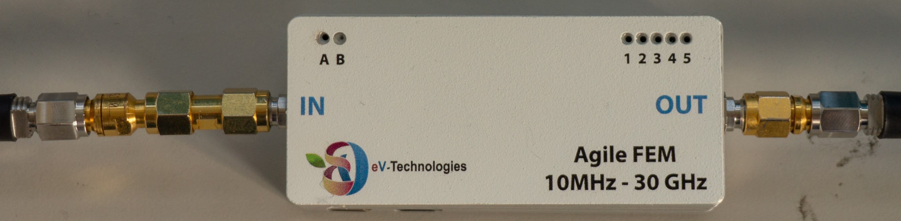

# eV-Technologies Front End Module 30GHz

> A 10MHz-30GHz Agile Front-End-Module

<a href="https://ev-technologies.com/">

## Description

The *EVT-AFEM-30GHz* is a dynamic LNA that can be configured to operate over 7 distinct bands spread over the range **10MHz to 30GHz**. The LNA features a wide full band mode.  Each band offers excellent out of band filtering. The higher bands from 8GHz to 30 GHz offer **tunable filters** that can be reconfigured to remove any unwanted products. The lower bands are split equally into band pass filters.  

For each band the gain can be adjusted from **+40dB to -40dB**.
The LNA has an integrated power detector that can be used to detect compression.  The LNA is also **thermally compensated** by way of an oven / temperature sensor to ensure excellent stability over time.

## Features list

- Dynamic LNA that can be configured to operate over 7 distinct bands spread over the range 10MHz to 30GHz
- The LNA features a wide full band mode
- Excellent out of band filtering
- Tunable filter for the band [8 – 30]GHz to remove any unwanted products
- Lower band (<8GHz) split equally in two band pass filter
  - Gain can be adjusted from -40 to +40 dB for each band
- Integrated power detector
- Thermally compensated to ensure excellent stability.

## Control options

- USB connection to control the LNA, connect as a serial port
- Can be controlled with LabVIEW, Matlab, C, Python, etc…
- Best suited when the gain need to be adjusted to allow the instrumentation to be reconfigured to accept very high inputs levels through to very low levels.

## How to use

1. Connect the FEM to a computer via the mini-USB port

2. Open a terminal with the following parameters (we recommand [*Termite*](https://www.compuphase.com/software_termite.htm))
    - COM Port: choose the correct one
    - Baudrate: 100000
    - Data bits: 8
    - Stop bits: 1
    - Parity: None
    - Flow Control: None
3. Send the desired command *

\* *If the command was received correctly the symbol 'O' is returned*

## Usable commands

- Change of frequency band:
  - 'C1' : 10 MHz – 30 GHz
  - 'C2' : 15 GHz – 30 GHz
  - 'C3' : 6 GHz – 12 GHz
  - 'C4' : 5,5 GHz – 8,5 GHz
  - 'C5' : 3,5 GHz – 7 GHz
  - 'C6' : 2 GHz – 5 GHz
  - 'C7' : 10 MHz – 3 GHz
- Control of the attenuators and high frequency filters:
  - 'DXX' where XX is in the range [00, 63] : Control the digital attenuator

Example command: `D00` To set the digital attenuator to 0

  - 'VXYYY' where X is in range [1, 2] and YYY in range [000, 255] : Control the digital attenuator

Example command: `V2100` To set the attenuator 2 to 100

  - 'FXXXY' where XXX is in range [0, 255] and Y in range [0, 1] : Control the high frequency filter

Example command: `F2351` To set the filter to 235 and bank 1

## What's in this repository ?

In `examples/python` you will find example code to use the FEM with python code.
No special library is required.

## About us

For any information please visit our website : [eV-Technologies](https://ev-technologies.com/)
